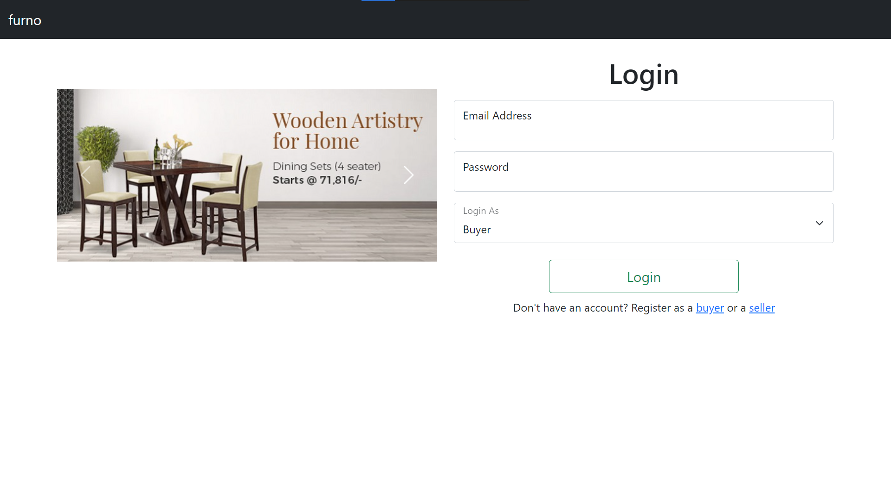
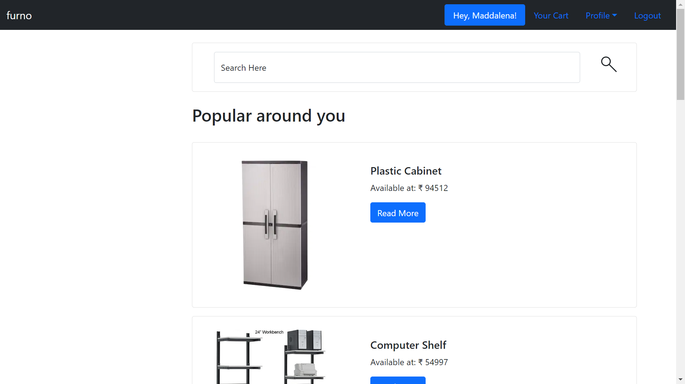
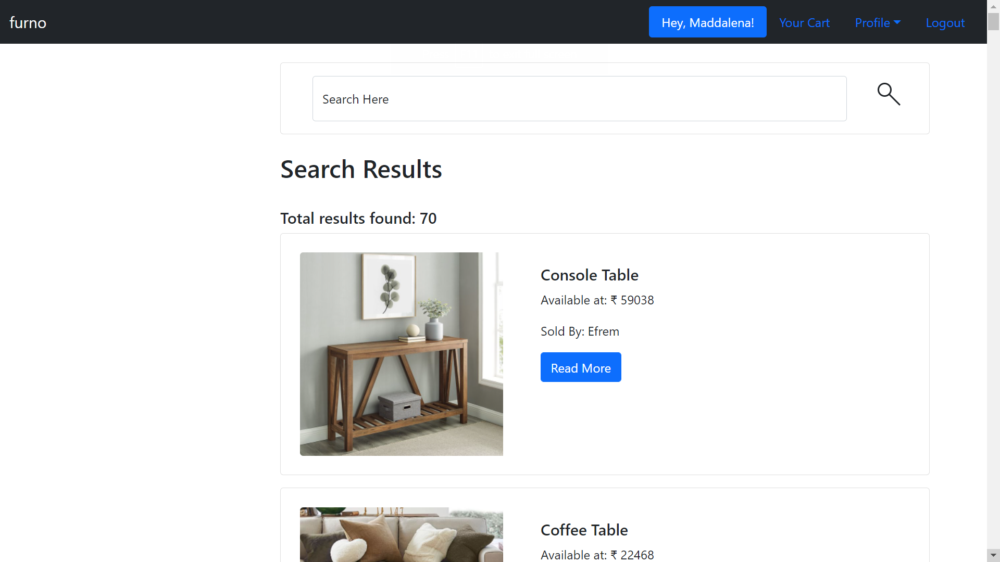
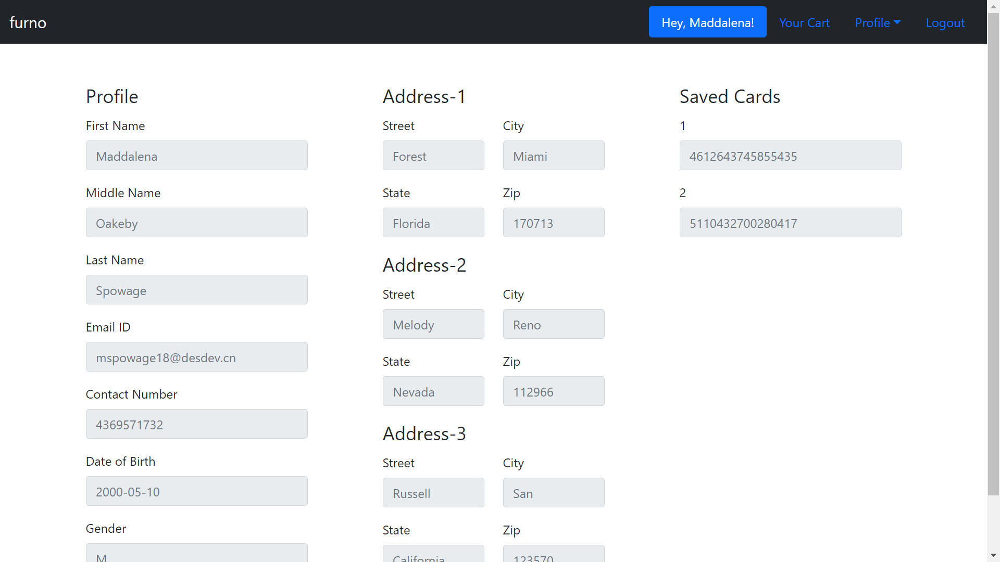

# furno
Course project for CSE202 (	Fundamentals of Database Management System) at IIIT-D for Winter 2022 semester.

## Project Setup
The project uses Python, MySQL, Bootstrap and Flask framework. Make sure to install the required. 
To get the required libraries:
```bash
pip install -r requirements.txt
```
Now, create a .env file in the same
```bash
touch .env
```
Add the following in the .env file
```bash
HOST=hostName
USER=username
PASSWORD=password
DB=furno
```
Now, lets create our database and add some data for testing.
Navigate to the file "dataDump\furnoWithImages.sql" and run the complete sql script to create the required database, tables and dump data.

Time to export the project name to enviornment variable
```bash
export FLASK_APP=furno
```
Finally, to run the application
```bash
flask run
```

## Screenshots
#### Login Page


#### Home Page


#### Search Results


#### View Profile

